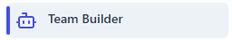
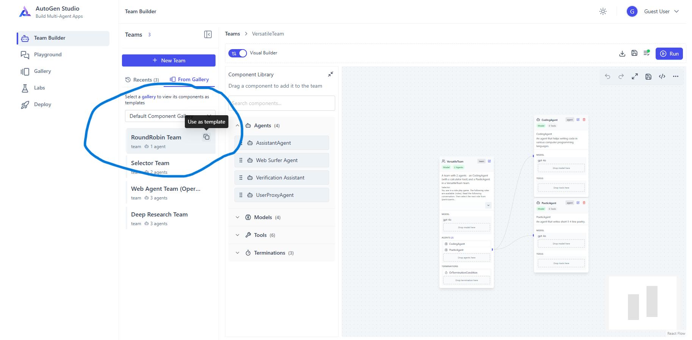

# AutoGen Studio 101

## Introduction


[AutoGen Studio](https://microsoft.github.io/autogen/stable/user-guide/autogenstudio-user-guide/index.html#) is a low-code interface built to help you rapidly prototype AI agents, enhance them with tools, compose them into teams and interact with them to accomplish tasks. It is built on [AutoGen AgentChat](https://microsoft.github.io/autogen) - a high-level API for building multi-agent applications.


In this 101 blog, we will build a simple multi-agent application completely on local machine - 
1) design a multi-agent team with [Reflection](https://microsoft.github.io/autogen/stable/user-guide/core-user-guide/design-patterns/reflection.html) design pattern using [AutoGen Studio](https://microsoft.github.io/autogen/stable/user-guide/autogenstudio-user-guide/index.html#)
2) deploy created team as an API endpoint 
3) deploy created team in a chainlit web application   


## Key Features

AutoGen Studio offers four main interfaces to help you build and manage multi-agent systems:

1. **Team Builder**
   - A visual interface for creating agent teams through declarative specification (JSON) or drag-and-drop
   - Supports configuration of all core components: teams, agents, tools, models, and termination conditions
   - Fully compatible with AgentChat’s component definitions

2. **Playground**
   - Interactive environment for testing and running agent teams
   - Features include:
     - Live message streaming between agents
     - Visual representation of message flow through a control transition graph
     - Interactive sessions with teams using UserProxyAgent
     - Full run control with the ability to pause or stop execution

3. **Gallery**
   - Central hub for discovering and importing community-created components
   - Enables easy integration of third-party components

4. **Deployment**
   - Export and run teams in Python code
   - Set up and test endpoints based on a team configuration
   - Run teams in a Docker container

## Getting Started

### Prerequisites

- "gpt-40" or "gpt-40-mini" model deployed in "Azure OpenAI". [Reference](https://learn.microsoft.com/en-us/azure/ai-foundry/how-to/deploy-models-openai#deploy-an-azure-openai-model-from-the-model-catalog)

### Installation


We recommend using a virtual environment as this will ensure that the dependencies for [AutoGen Studio](https://microsoft.github.io/autogen/stable/user-guide/autogenstudio-user-guide/index.html#) are isolated from the rest of your system.

#### venv
Create and activate:

```sh
python3 -m venv .venv
# On Windows (PowerShell)
.venv\Scripts\Activate.ps1
# On Linux or macOS (bash/zsh)
source .venv/bin/activate
```

To deactivate later, run:

```sh
deactivate
```

#### Install from PyPi (Recommended)

You can install [AutoGen Studio](https://microsoft.github.io/autogen/stable/user-guide/autogenstudio-user-guide/index.html#) using pip, the Python package manager.

```sh
pip install -U autogenstudio
```
This blog is authored with autogenstudio version: 0.4.2.1.
For more details, see the [official installation guide](https://microsoft.github.io/autogen/stable/user-guide/autogenstudio-user-guide/installation.html).

### Starting AutoGen Studio
Once installed, run the web UI by entering the following in your terminal. Before starting it, we also need to set Azure OpenAI's key in an environment variable. 

```sh
# On Windows (PowerShell)
$env:AZURE_OPENAI_API_KEY="<API_KEY>"
# On Linux or macOS (bash/zsh)
export AZURE_OPENAI_API_KEY="<API_KEY>"
# Start Autogen Studio Web UI
autogenstudio ui --port 8081
```

After it starts sucessfully, Open the URL (printed in the output messages e.g. http://127.0.0.1:8081/build/) in your browser.

## Step 1 - Design a multi-agent team with [Reflection](https://microsoft.github.io/autogen/stable/user-guide/core-user-guide/design-patterns/reflection.html) design pattern using [AutoGen Studio](https://microsoft.github.io/autogen/stable/user-guide/autogenstudio-user-guide/index.html#)

1. Click on “Team Builder” icon at the top of the left-most sidebar

   

2. In "Teams" sidebar, go to "From Gallery" tab. Then click on "Use as template" icon against "RoundRobin Team".

    

3. In "Teams" sidebar, go to "Recents" tab and you should see a new Team named "RoundRobin Team_XXXXX".

4. Under "Component Library", expand "Models" section. From this section, drag "AzureOpenAI GPT-4o" model to the AssistantAgent's model section.
 
    <video width="480" controls>
      <source src="Step4_recording.mp4" type="video/mp4">
    </video>

5. Click on "Edit" icon at top right of "AssistantAgent". It shall open a pop-up "Edit Component". Enter the following values on this page -
    **Component Details**  
    Name: `CoderAgent`  
    Description: An agent that performs code writing tasks.

    **Configuration**  
    Name: `CoderAgent`  
    System Message:
    ```text
    You are a proficient coder. You write code to solve problems.
    Work with the reviewer to improve your code.
    Always put all finished code in a single Markdown code block.
    For example:
        ```python
        def hello_world():
            print("Hello, World!")
        ```

    Respond using the following format:

    Thoughts: <Your comments>
    Code: <Your code>
    ```
    Tools: Delete Calculator tool


6. On the same page, click on "Configure Model" next to "gpt-4o", it shall open a new page.Enter following values on this page -
    **Azure Configuration section**

    | Setting             | Value / Description                                                                                  |
    |---------------------|-----------------------------------------------------------------------------------------------------|
    | **Model**           | `gpt-4o` <br> *( Model that you have deployed. )*                                                 |
    | **API Key**         | *(Leave this blank)*                                                                                |
    | **Azure Endpoint**  | `https://<azure-endpoint>.openai.azure.com/` <br> *(Find this in Azure AI Foundry or resource properties.)* |
    | **Azure Deployment**| `gpt-4o` <br> *(Name of your deployment )*                                                      |
    | **API Version**     | `2025-01-01-preview` <br> *( Change this to match your endpoint's API version )*               |

    To verify all details are entered correctly, click "Test" at the top right. If all values are entered correctly shall display a message `Model test completed successfully`

    Note - If you get an error, click on "Form Editor" on the right side of "Test" and it shall display JSON definition. If it contains "api_key" as a field, delete that field (both key and value) from JSON. After deleting "api_key" field, click on "Test" again.
    Why? - We defiend "AZURE_OPENAI_API_KEY" as an environment variable before starting AutoGen Studio and hence, no need to define "api_key" field.

7. Click on "Save Changes" at the bottom and it shall bring us back to "Visual Builder" screen.

8. From "Component Library", drag "AssistantAgent" onto "RoundRobin Team_XXXXX" block's "AGENTS" section.

    <video width="480" controls>
      <source src="Step8_recording.mp4" type="video/mp4">
    </video>

9. For the new "AssistantAgent" created, click on "Edit" icon at top right. It shall open a pop-up "Edit Component". Enter the following values on this page -
    **Component Details**  
    Name: `ReviewerAgent`  
    Description: An agent that performs code review tasks.

    **Configuration**  
    Name: `ReviewerAgent`  
    System Message:
    ```text
    You are a code reviewer. You focus on correctness, efficiency and safety of the code.
    Respond using the following JSON format:
    {
        "correctness": "<Your comments>",
        "efficiency": "<Your comments>",
        "safety": "<Your comments>",
        "approval": "<APPROVE or REVISE>",
        "suggested_changes": "<Your comments>"
    }
    ```
    Tools: Delete Calculator tool


10. Modify the model details of "ReviewerAgent" by repeating steps 4 and 6 above for "ReviewerAgent".

11. Edit the "RoundRobin Team_XXXXX" component with following details -
    **Component Details** 
    Name - `Dev Team`
    Description - `Two agents - CoderAgent and ReviewerAgent in a RoundRobinGroupChat team.`
    **Configuration**
        Edit "orTerminationCondition"
            Edit "TextMentionTermination"
                Enter \"APPROVE\"
    Click "Save Changes" at bottom.

12. Now our multi-agent team is ready. Let's test it out. Click on "Run" at the top right corner to "Visual Builder"

    <video width="480" controls>
      <source src="Step12_recording.mp4" type="video/mp4">
    </video>

13. With multi-agent team functioning as expected, 
    a. Download the team definition by clicking on the "Download Team" icon (the first icon before the "Run" button).  
    b. Once the download is complete, rename the file to `dev-team-config.json`.  
    c. For reference, here is a sample file [dev-team-config.json](dev-team-config.json)


## Step 2 - Deploy created team as an API endpoint 

1. AutoGen Studio offers a convenience CLI command to serve a team as a REST API endpoint.

```sh
# On Windows (PowerShell)
$env:AZURE_OPENAI_API_KEY="<API_KEY>"
# On Linux or macOS (bash/zsh)
export AZURE_OPENAI_API_KEY="<API_KEY>"

# Serve your team as an API endpoint on port 8084
# autogenstudio serve --team <path/to/team.json> --port 8084
autogenstudio serve --team ./dev-team-config.json --port 8084
```

2. Official AutoGen Studio [documentation](https://autogenstudio.example.com/docshttps://microsoft.github.io/autogen/stable/user-guide/autogenstudio-user-guide/index.html) doesn't include much details of defintions of these APIs. But, you can find that out by downloading "openapi" definition of this API. If the api is running on "http://127.0.0.1:8084", navigate to "http://127.0.0.1:8084/openapi.json". It shows that there is a "Predict" api which takes "Task" as input string. 

3. Here is a [sample API client code](autogen-api-client.py).

## Step 3 - Deploy created team in a chainlit web application 

1. Create a streamlit application that takes user-input and invokes AutoGen Team with task = user's input message. Here is a [sample streamlit app](streamlit-app.py).

2. Start streamlit app to test multi-agent team

```sh
# On Windows (PowerShell)
$env:AZURE_OPENAI_API_KEY="<API_KEY>"
# On Linux or macOS (bash/zsh)
export AZURE_OPENAI_API_KEY="<API_KEY>"

# Start streamlit Web UI
streamlit run streamlit-app.py
```
3. Here is a short demo of the experience.
    <video width="480" controls>
      <source src="streamlit_recording.mp4" type="video/mp4">
    </video>

## Resources & Further Reading

- [Official Documentation](https://autogenstudio.example.com/docshttps://microsoft.github.io/autogen/stable/user-guide/autogenstudio-user-guide/index.html)

- [GitHub Repository](https://github.com/microsoft/autogen/tree/main/python/packages/autogen-studio)

## Conclusion


[AutoGen Studio](https://microsoft.github.io/autogen/stable/user-guide/autogenstudio-user-guide/index.html#) makes multi-Agent application development accessible and efficient. Start experimenting today and unlock new possibilities for your projects!
